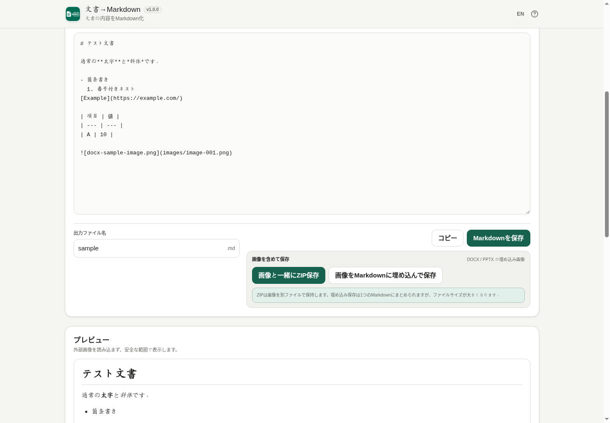

# Document to Markdown

[](https://github.com/ttomohisa/htmlapps-document-to-markdown/actions/workflows/deploy-pages.yml)
[](LICENSE)
[](https://ttomohisa.github.io/htmlapps-document-to-markdown/)

[English README](README.md)

DOCX・PPTX・XLSX・PDF・TXT・HTML・CSV・TSVの内容を、ファイルを外部へ送信せずブラウザ内でMarkdownへ変換する単一HTMLアプリです。

## 🚀 デモ

### [GitHub PagesでDocument to Markdownを開く](https://ttomohisa.github.io/htmlapps-document-to-markdown/)

GitHub Pagesから最初のHTMLを読み込んだ後、ファイル解析・Markdown生成・プレビュー・保存は端末内で処理されます。選択した文書や変換結果をアプリが外部サーバーへ送信することはありません。

[](https://ttomohisa.github.io/htmlapps-document-to-markdown/)

## 主な機能

- **再選択せず再試行** — 失敗・キャンセルした行を、出力ファイル名と一覧の位置を保ったまま再変換できます。

- **Office・PDF・テキストをMarkdownへ変換** — DOCX / PPTX / XLSX / PDF / TXT / HTML / CSV / TSVに対応します。
- **文書構造をできるだけ保持** — 見出し、段落、リスト、表、リンク、PowerPointのSpeaker Notes、Excelのシート構造などを再利用しやすいMarkdownへ変換します。
- **変換品質を確認できる** — 「変換済み / 確認推奨 / 変換対象外 / 一部失敗」を分けて表示し、スライド・シート・ページ位置も可能な範囲で示します。
- **埋め込み画像を扱える** — DOCX / PPTXの画像を相対パスで参照し、画像付きZIPとして保存できます。必要な場合は画像をBase64でMarkdownへ直接埋め込むこともできます。
- **複数ファイルをまとめて処理** — 最大20ファイル、合計300 MBまでキューへ追加し、ファイルごとの状態を確認できます。
- **安全なローカル処理** — PDF.jsを含む必要なランタイムをHTMLへ内包し、`connect-src 'none'` で実行時の外部通信を禁止しています。
- **日本語 / 英語・PC / スマートフォン対応** — 同じHTML内で言語を切り替え、スマートフォンではファイル / Markdown / プレビュー / 情報を下部タブで切り替えます。

## すぐに使う

### Webで使う

[デモを開く](https://ttomohisa.github.io/htmlapps-document-to-markdown/)だけで利用できます。インストールやアカウント登録は不要です。

### ダウンロードして使う

1. GitHub Actionsのビルド成果物、またはリポジトリの `dist/index.html` を用意します。
2. `index.html` を最新のChromiumベースブラウザ、Firefox、Safariで開きます。
3. 以降の文書変換はブラウザ内だけで処理されます。

### ビルドして使う（advance）

1. このリポジトリをダウンロードまたはクローンします。
2. Windowsで `build-standalone.bat` を実行します。
3. 固定された依存パッケージから `dist/index.html` と `dist/index.self-extract.html` が生成されます。
4. 生成されたHTMLを任意の場所へコピーして利用します。

テンプレート標準のPowerShellビルドが、依存固定・単一HTML化・CSP・外部通信・未解決プレースホルダー・self-extract整合性を検証します。

## 使い方

1. DOCX・PPTX・XLSX・PDF・TXT・HTML・CSV・TSVを選択するか、画面へドラッグ＆ドロップします。
2. 複数ファイルの場合はキューに追加され、順番に変換されます。
3. 完了したファイルを選び、**Markdown / プレビュー / 文書情報**を確認します。
4. 必要に応じて出力ファイル名を変更し、コピーまたは保存します。
5. 複数ファイルの結果は **すべてZIP保存** でまとめて保存できます。

### 保存方法

通常のMarkdownは `.md` として保存できます。

DOCX / PPTXに埋め込み画像がある場合は、追加で2つの保存方法を選べます。

- **画像と一緒にZIP保存** — Markdownでは `images/image-001.png` のような相対パスを使い、画像ファイルを同じZIPに保存します。通常はこちらを推奨します。
- **画像をMarkdownに埋め込んで保存** — `data:image/...;base64,...` として画像をMarkdown内へ直接埋め込み、1つの `.md` にまとめます。持ち運びやすい一方、ファイルサイズは大きくなります。

元のMarkdown表示はどちらの保存方法を選んでも変更されません。

### 変換品質レポート

文書情報では、変換結果を次の4種類に分けて表示します。

- **変換済み** — 通常どおりMarkdown化できた内容
- **確認推奨** — 結合セルや複雑なPDFレイアウトなど、近似変換を含む内容
- **変換対象外** — SmartArt、動画、未対応の埋め込みオブジェクトなど
- **一部失敗** — 一部を読み取れなかったものの、残りの内容は利用できる状態

変換精度を根拠なくパーセント表示することはありません。

## GitHub Pagesで公開する

このリポジトリには、単一HTMLをビルドしてGitHub Pagesへ自動公開するワークフローが含まれています。

1. **Settings → Pages → Build and deployment → Source** で **GitHub Actions** を選択します。
2. `main` ブランチへプッシュするか、Actionsから **Deploy standalone app to GitHub Pages** を実行します。
3. ビルド成功後、`https://ttomohisa.github.io/htmlapps-document-to-markdown/` で公開されます。

`main` へのプッシュ時には、固定依存からstandalone HTMLを再生成し、テンプレート標準の検証を通してから公開します。

## 開発とビルド

```text
.
├─ src/index.template.html       # アプリ本体
├─ app.config.json               # アプリ名・版数・ビルド設定
├─ dependencies.json             # 内包依存の定義
├─ dependencies.lock.json        # 固定バージョンとハッシュ
├─ build-standalone.bat          # Windows用ビルド入口
├─ build-standalone.ps1          # 単一HTML生成
├─ scripts/                      # 検証・self-extract生成
├─ assets/                       # favicon / screenshots
└─ dist/
   ├─ index.html                 # readable standalone
   └─ index.self-extract.html    # gzip self-extract版
```

開発時は `src/index.template.html` を編集し、`dist/` を直接編集しないでください。

## プライバシーと通信防止

Document to Markdownは、選択した文書の内容を外部サーバーへ送信しません。

- Content Security Policyに `connect-src 'none'` を設定
- PDF.js本体・Worker・日本語CMapをビルド時にHTMLへ内包
- HTML入力内のスクリプトを実行しない
- 外部リンクや外部参照画像を自動取得しない
- 文書内容、変換Markdown、抽出画像を自動で永続保存しない

GitHub Pages版では最初のHTML配信だけが発生します。ネットワークを完全に切って利用する場合は、生成済みの `dist/index.html` をローカルで開いてください。

## 制限事項

- PDFは文字レイヤーを利用します。スキャンPDFや画像だけのPDFに対するOCRはv1.0.0では行いません。
- PDFの見出し・段落・読み順は配置から推定するため、複雑な段組み・表・縦書き・回転文字では確認が必要な場合があります。
- DOCX / PPTX / XLSXの暗号化・パスワード保護ファイルには対応していません。
- PPTXのグラフ、SmartArt、動画・音声、アニメーションなどは完全にはMarkdown化しません。
- XLSXの数式は実行しません。保存済み計算結果があればその値を使い、結果がない場合は数式文字列を残します。
- 旧Office形式（`.doc` / `.ppt` / `.xls`）、EPUB、OpenDocument、URLからの変換には対応していません。
- 1ファイル100 MB、最大20ファイル、合計300 MBが現在の入力上限です。
- Base64画像埋め込みMarkdownは、通常の画像付きZIPよりファイルサイズが大きくなります。

## 使用ライブラリ

| ライブラリ | バージョン | ライセンス | 用途 |
| --- | ---: | --- | --- |
| PDF.js / pdfjs-dist | 6.2.108 | Apache-2.0 | PDF解析、文字抽出、日本語CMap |

DOCX / PPTX / XLSXのOOXML解析、CSV / TSV、HTML、ZIP出力はブラウザ標準APIとアプリ内コードで処理しています。詳細は [THIRD_PARTY_NOTICES.md](THIRD_PARTY_NOTICES.md) を確認してください。

## コントリビューション

バグ報告や機能提案はIssueからお願いします。開発への参加方法は [CONTRIBUTING.md](CONTRIBUTING.md) を確認してください。

## ライセンス

Copyright © 2026 ttomohisa

このプロジェクトは [MIT License](LICENSE) で公開されています。

## PRプレビューと回帰テスト

同じリポジトリ内のPRでは、既存の `CLOUDFLARE_API_TOKEN` と `CLOUDFLARE_ACCOUNT_ID` が設定済みの場合にCloudflare Workers Previewを作成し、URLをコメントします。PRを閉じると別ワークフローで削除します。シークレット未設定時はプレビューをスキップするため、ビルド成功だけではプレビュー作成済みとは限りません。

Node.js 24とPowerShellを用意し、`scripts/check-powershell-syntax.ps1`、`scripts/check-repository.ps1` の順に実行します。チェックは `tests/` の固定バージョンの開発用依存を導入し、変換・キューの回帰テストと両HTMLのビルドを実行します。通常のビルドでは `document-to-markdown.html` も `dist/index.html` と完全一致するよう再生成します。直接編集しないでください。
