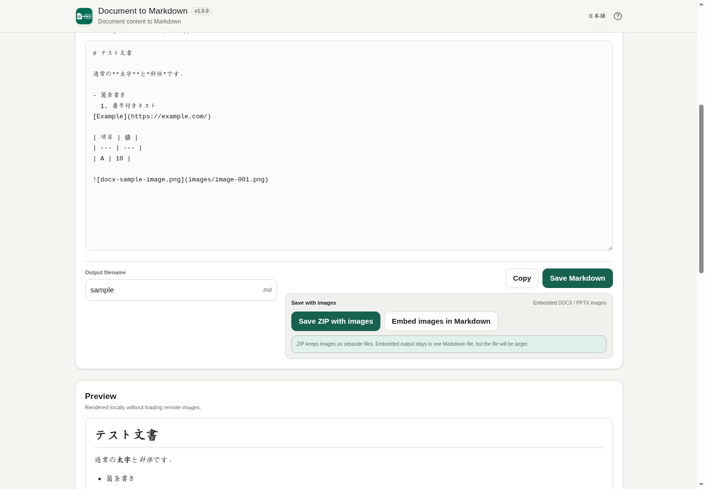

# Document to Markdown

[](https://github.com/ttomohisa/htmlapps-document-to-markdown/actions/workflows/deploy-pages.yml)
[](LICENSE)
[](https://ttomohisa.github.io/htmlapps-document-to-markdown/)

[日本語版 README](README.ja.md)

A single-HTML app that converts DOCX, PPTX, XLSX, PDF, TXT, HTML, CSV, and TSV content to Markdown without uploading selected files to a server.

## 🚀 Live demo

### [Open Document to Markdown on GitHub Pages](https://ttomohisa.github.io/htmlapps-document-to-markdown/)

GitHub Pages delivers the initial HTML. After it loads, document parsing, Markdown generation, preview, and export are processed on your device. The selected documents and generated results are not uploaded by the app.

[](https://ttomohisa.github.io/htmlapps-document-to-markdown/)

## Features

- **Convert common document formats to Markdown** — Supports DOCX, PPTX, XLSX, PDF, TXT, HTML, CSV, and TSV.
- **Preserve useful document structure** — Extract headings, paragraphs, lists, tables, links, PowerPoint speaker notes, worksheet structure, and other reusable content.
- **See what converted and what did not** — The quality report separates Converted, Check recommended, Not converted, and Partial failure items, with slide, sheet, or page locations where available.
- **Keep embedded images** — DOCX / PPTX images can be exported with relative Markdown paths in a ZIP, or optionally embedded directly into one Markdown file as Base64 data.
- **Process multiple files** — Add up to 20 files with a 300 MB total batch limit and review per-file states.
- **Local runtime with no document upload** — PDF.js and required support assets are embedded in the HTML, and the app uses `connect-src 'none'` at runtime.
- **Japanese / English and mobile-friendly UI** — The same HTML supports both languages and provides File / Markdown / Preview / Info tabs on small screens.

## Quick start

### Use the web demo

Just [open the demo](https://ttomohisa.github.io/htmlapps-document-to-markdown/). No installation or account is required.

### Use a downloaded file

1. Get `dist/index.html` from a build artifact or a built copy of this repository.
2. Open it in a current Chromium-based browser, Firefox, or Safari.
3. Document conversion runs locally in the browser.

### Build it locally (advanced)

1. Download or clone this repository.
2. Run `build-standalone.bat` on Windows.
3. The pinned dependencies are embedded into `dist/index.html` and `dist/index.self-extract.html`.
4. Copy either generated HTML file wherever you need it.

The template build validates pinned dependencies, single-file output, CSP, runtime network restrictions, unresolved placeholders, and the self-extract payload.

## Usage

1. Choose or drag DOCX, PPTX, XLSX, PDF, TXT, HTML, CSV, or TSV files into the app.
2. Multiple files are queued and converted sequentially.
3. Select a completed result and review **Markdown / Preview / Document information**.
4. Change the output filename if needed, then copy or save the result.
5. Use **Save all as ZIP** when you want to package all successful batch results together.

### Save options

Normal output is saved as a `.md` file.

When a DOCX or PPTX result contains embedded images, two additional options appear:

- **Save ZIP with images** — Markdown keeps relative paths such as `images/image-001.png`, and the referenced image files are stored in the same ZIP. This is the recommended default for most use cases.
- **Embed images in Markdown** — Images are converted to `data:image/...;base64,...` references so the result stays in one `.md` file. This is convenient to move around, but the Markdown file becomes larger.

The Markdown shown in the app is not modified by either export option.

### Conversion quality report

Document information separates conversion results into four groups:

- **Converted** — Content converted normally.
- **Check recommended** — Approximate or layout-sensitive conversion such as merged cells or complex PDF layout.
- **Not converted** — Detected content such as SmartArt, video, or unsupported embedded objects.
- **Partial failure** — Some content could not be read, while usable content was still preserved.

The app does not present an invented accuracy percentage.

## Publish with GitHub Pages

The repository includes a workflow that builds the standalone HTML and deploys it to GitHub Pages.

1. Open **Settings → Pages → Build and deployment → Source** and select **GitHub Actions**.
2. Push to `main`, or manually run **Deploy standalone app to GitHub Pages** from Actions.
3. After a successful deployment, the app is available at `https://ttomohisa.github.io/htmlapps-document-to-markdown/`.

Each push to `main` rebuilds the standalone artifacts from pinned dependencies and runs the template verification before deployment.

## Development and build layout

```text
.
├─ src/index.template.html       # Application source template
├─ app.config.json               # App metadata and build settings
├─ dependencies.json             # Embedded dependency definitions
├─ dependencies.lock.json        # Pinned versions and hashes
├─ build-standalone.bat          # Windows build entry point
├─ build-standalone.ps1          # Standalone builder
├─ scripts/                      # Validation and self-extract scripts
├─ assets/                       # Favicon and screenshots
└─ dist/
   ├─ index.html                 # Readable standalone build
   └─ index.self-extract.html    # Gzip self-extracting build
```

Edit `src/index.template.html`, not generated files in `dist/`.

## Privacy and runtime network protection

Document to Markdown does not upload selected document content.

- Content Security Policy includes `connect-src 'none'`.
- PDF.js, its worker, and required Japanese CMaps are embedded at build time.
- Scripts inside imported HTML are not executed.
- External links and externally referenced images are not fetched automatically.
- Source documents, generated Markdown, and extracted images are not automatically persisted.

The GitHub Pages version requires the initial HTML request. For use with the network fully disconnected, open the generated `dist/index.html` locally.

## Limitations

- PDF conversion uses the extractable text layer. OCR for scanned or image-only PDFs is not included in v1.0.0.
- PDF headings, paragraphs, and reading order are inferred from layout, so complex columns, tables, vertical text, or rotated text may need review.
- Encrypted or password-protected DOCX / PPTX / XLSX files are not supported.
- PPTX charts, SmartArt, video/audio, animations, and some embedded objects are not reconstructed as Markdown.
- XLSX formulas are never executed. Cached results are used when available; otherwise the formula text is preserved.
- Legacy Office formats (`.doc`, `.ppt`, `.xls`), EPUB, OpenDocument formats, and remote URL conversion are not supported.
- Input limits are 100 MB per file, up to 20 files, and 300 MB total.
- Base64-embedded Markdown is larger than the normal Markdown + images ZIP output.

## Dependencies

| Library | Version | License | Purpose |
| --- | ---: | --- | --- |
| PDF.js / pdfjs-dist | 6.2.108 | Apache-2.0 | PDF parsing, text extraction, Japanese CMaps |

DOCX / PPTX / XLSX OOXML parsing, CSV / TSV, HTML conversion, and ZIP export are implemented with browser APIs and application code. See [THIRD_PARTY_NOTICES.md](THIRD_PARTY_NOTICES.md) for details.

## Contributing

Bug reports and feature proposals are welcome through GitHub Issues. See [CONTRIBUTING.md](CONTRIBUTING.md) for development guidance.

## License

Copyright © 2026 ttomohisa

Licensed under the [MIT License](LICENSE).
